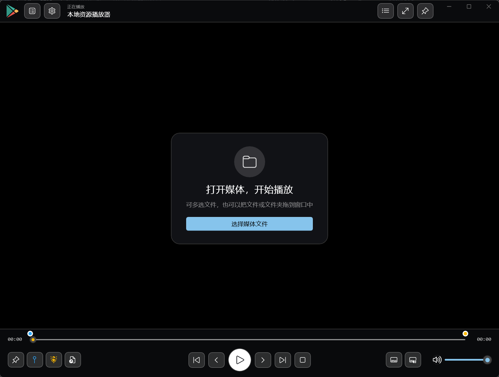
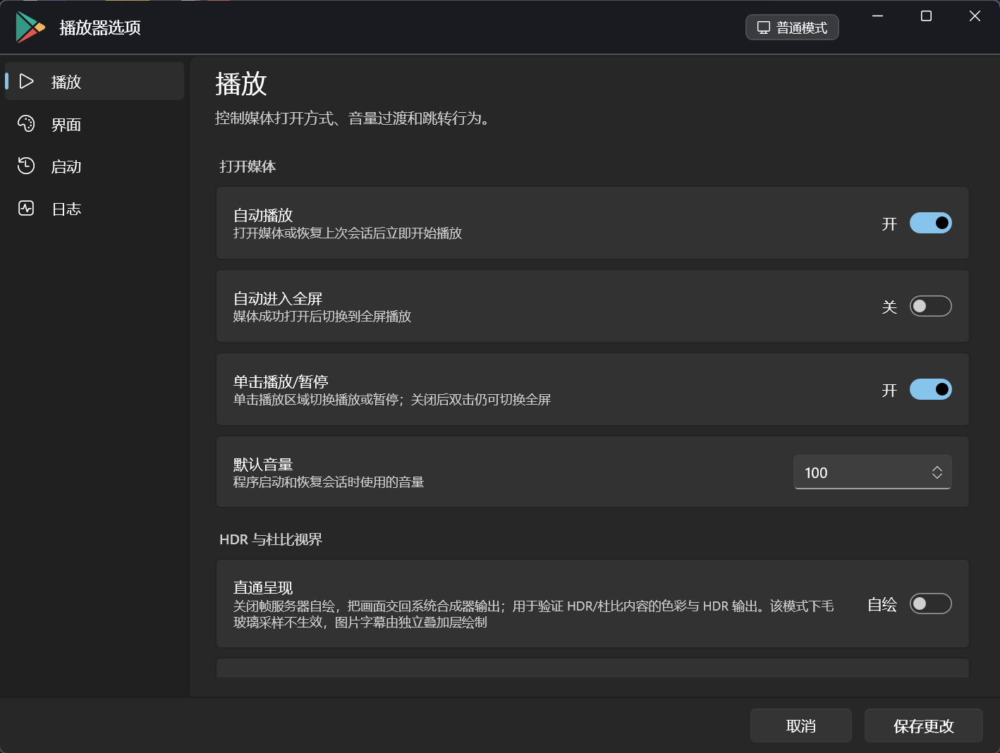

<p align="center">
  
</p>

<h1 align="center">WinPlayer.WinUI</h1>

<p align="center">
  基于 <b>WinUI 3</b> 与 Windows 原生 <code>MediaPlayer</code> 的桌面媒体播放器：<br>
  视频画面铺满窗口，标题栏、媒体文件夹、播放列表与控制栏以悬浮毛玻璃面板呈现。
</p>

<p align="center">
  
  
  
  
</p>

---

## 简介

WinPlayer.WinUI 是一个面向 Windows 10/11 的本地媒体播放器。它不做解码工作，而是把播放交给
Windows 原生媒体框架，自己专注在**播放体验与界面**上：无边框沉浸式窗口、Win2D 毛玻璃面板、
侧栏自动隐藏、双击全屏、片头片尾自动跳过、断点续播，以及一套完全独立的**隐私播放模式**。

项目采用 MVVM 组织代码，界面层（`MainWindow` / `SettingsWindow`）只负责渲染与交互，
播放状态、播放列表、持久化与系统集成都收敛在 `ViewModels` 与 `Services` 中。

## 界面预览

主界面：视频画面铺满窗口，标题栏、媒体文件夹、播放列表与控制栏都是悬浮的毛玻璃面板。

<p align="center">
  
</p>

选项窗口：独立窗口，不随主窗口缩小而被裁切（图中处于隐私模式，因此设置保存到 `settings.b.json`）。
窗口背景使用与主窗口相同的系统 **Mica** 毛玻璃材质。

<p align="center">
  
</p>

### 界面里的两套「毛玻璃」

程序里有两层来源完全不同的半透明效果，不要混淆：

| 机制 | 出现在哪 | 采样对象 | 可调 |
| --- | --- | --- | --- |
| 系统 **Mica** 材质 | 主窗口与**选项窗口**的窗口背景（两个窗口的 XAML 都设置了 `<MicaBackdrop Kind="BaseAlt" />`） | 桌面壁纸 | 否 |
| Win2D `BackdropBlurBrush` | **主窗口**的悬浮面板：标题栏、媒体文件夹树、播放列表、控制栏 | **其背后的视频画面** | 是（毛玻璃模糊强度、色调不透明度） |

所以下文「直通呈现」所说的「毛玻璃采样不生效」指的是**第二层**——悬浮面板不再采样视频。
窗口的 Mica 背景、以及选项窗口本身的毛玻璃效果不受影响。

> Mica 是 Windows 11 的材质。本程序声明支持 Windows 10 1809 及以上，但 Windows 10 不提供 Mica，
> 在那类系统上窗口会退回为普通背景。

## 功能特性

**播放**

- 播放常见视频与音频文件，支持暂停、上一项 / 下一项、快进快退、拖动进度条定位
- 鼠标滚轮调整音量，支持静音，新媒体播放时音量渐入
- 全屏播放；单击播放区域切换播放/暂停，双击进入或退出全屏，拖动播放区域移动窗口
- 字幕轨道与音频轨道检测、菜单展示与切换，支持外挂字幕与位图字幕（详见[字幕支持](#字幕支持)）
- 可拖动设置片头结束位置与片尾开始位置，自动跳过片头/片尾
- 保存并恢复每个文件的播放位置，支持历史记录保留天数与记录清理

**界面**

- 视频画面作为窗口背景，标题栏、文件夹树、播放列表、控制栏均为悬浮毛玻璃面板（采样背后的视频）
- 主窗口与选项窗口都使用系统 **Mica** 材质作为窗口背景（见[界面里的两套「毛玻璃」](#界面里的两套毛玻璃)）
- 毛玻璃模糊强度与色调不透明度可调（作用于主窗口面板的 Win2D 毛玻璃）
- 左侧媒体文件夹树与右侧播放列表，支持拖入文件或文件夹（异步扫描，不阻塞界面）
- 侧栏宽度可拖动调整，可独立显示 / 隐藏，带自动隐藏动画
- 底部控制栏可自动隐藏或固定显示，延迟与动画时长可调
- 毛玻璃模糊强度与色调不透明度可调
- 独立的选项窗口，导航分为「播放 / 界面 / 记录与启动 / 诊断日志」四页

**系统集成**

- 可配置单例运行：后续启动的参数会转发给已有窗口
- 文件关联注册与移除（仅写当前用户注册表，无需管理员权限），并提供系统「默认应用」入口
- 记录窗口位置，下次启动恢复
- 任务栏图标与应用标识按模式区分

**HDR 与杜比视界**

- 三条呈现路径：自绘（默认）、把画面交回系统合成器的「直通呈现」，以及内置的 **libmpv 杜比视界引擎**
- libmpv 引擎用 libmpv 软件渲染 API + libplacebo 滤镜链完成杜比视界重塑与色调映射，
  可正确呈现系统媒体框架必然发绿/发紫的杜比视界 Profile 5（详见 [HDR 与杜比视界支持](#hdr-与杜比视界支持)）
- HDR / 杜比诊断：一键输出呈现路径、系统降级原因、显示器高级颜色能力与视频轨道的杜比视界标记
- 可登记一个支持杜比视界的外部播放器，把系统无法呈现的内容交给它打开

**隐私播放模式**

- 由启动参数决定整个进程的运行模式，播放器本身不保存任何「隐私开关」
- 与普通模式**数据完全隔离**：独立的记录文件、设置文件、日志、单例互斥体、激活管道与任务栏标识
- 隐私模式不改动播放列表与媒体文件夹列表，不修改注册表，日志不记录媒体完整路径
- 两种模式可同时运行，各自独立窗口与任务栏按钮
- ⚠️ **隔离不等于加密**：记录与设置均为明文 JSON

## 支持的格式

```text
.avi  .mp4  .mkv  .iso  .wmv  .vob  .mpg  .mpeg  .rmvb  .rm  .dat  .mov
.m4v  .webm .ts   .mts  .m2ts .mp3  .m4a  .wav  .flac  .ape  .aac  .ogg
```

> 扩展名受支持不代表系统一定能解码。实际解码能力取决于本机已安装的媒体编解码器——
> 缺少 HEVC / 杜比视界扩展时，对应内容会无法播放或呈现异常。

## 字幕支持

### 字幕来源

| 来源 | 由谁处理 |
| --- | --- |
| 容器内嵌文本字幕 | 本程序绘制（字体、字号、底部位置可调） |
| 容器内嵌位图字幕 | **由系统解码并合成**，本程序不解析这类字幕 |
| 外挂 `.srt` | 本程序自己的 SRT 解析器（自动识别 UTF-8 / BOM / UTF-16 LE / UTF-16 BE，失败时按 GB18030 兜底） |
| 外挂 `.sup`（蓝光 PGS） | 本程序自己的 PGS 解码器，解码成位图后画在独立的叠加画布上 |
| 外挂 `.sub`（VobSub） | 交给系统，**必须有同名的 `.idx` 索引文件**，否则加载失败 |
| 外挂 `.ass` / `.ssa` / `.vtt` / `.ttml` | 交给系统，按纯文本行呈现（**不套用 ASS 样式**） |

「加载外挂字幕…」接受 `.srt`、`.ass`、`.ssa`、`.vtt`、`.ttml`、`.sup`、`.sub` 共 7 种扩展名，
**不含 `.idx`**——而 VobSub 又必须配对同名 `.idx`，所以 `.sub` 只能配合目录中已存在的索引使用。

> 字幕能否使用取决于片源里实际存在的字幕轨与编码格式。本程序自带的位图字幕解码只针对**独立的
> `.sup` 文件**，覆盖范围有限（边界见下方「需要注意的行为」）；容器内嵌的位图字幕由系统处理，
> 能否显示同样取决于系统。

### 字幕菜单

底部控制栏的「字幕轨道」按钮打开字幕菜单：

- **本项目字幕** —— 控制本程序是否绘制自己的字幕层
- 引擎字幕轨列表 —— libmpv 引擎模式下列出引擎读到的字幕轨
- **关闭字幕**
- **加载外挂字幕…**

libmpv 引擎模式会记住上次选择的字幕轨（或「关闭字幕」），切换媒体后继续沿用，不回落到片源默认轨。

### 字幕外观

在「选项 → 界面 → 字幕」中调整：

| 设置 | 默认值 | 说明 |
| --- | --- | --- |
| 本项目字幕 | 显示 | 关闭后本程序不再绘制自己的字幕（文本浮层与图片字幕），字幕完全交给播放引擎/系统 |
| 字幕字体 | Segoe UI | 文本字幕使用的字体 |
| 字幕基准字号 | 24 | 字幕文字大小，随播放区域缩放 |
| 字幕底部位置 | 17% | 字幕与播放区域底部的距离，按播放区域高度百分比计算 |

### 自动发现同目录字幕

媒体文件所在目录下的字幕会被自动识别：文件名等于媒体名，或以「媒体名.」「媒体名_」开头。
按名称排序后，第一个成功加载的会被自动启用。

### 需要注意的行为

- **没有「默认字幕轨」设置**：打开媒体时各字幕轨都是关闭的，需要手动选择；该选择也不会跨媒体保留
  （libmpv 引擎模式除外）。
- **libmpv 引擎模式下「加载外挂字幕…」不起作用**：该入口依赖系统媒体会话，而引擎模式下媒体由
  libmpv 播放。此时外挂字幕要靠 mpv 自己的 `sub-auto` 自动发现。
- 关闭「本项目字幕」只停止**本程序自己的**字幕层；由系统合成的那类位图字幕不受影响。
- 本程序自带的 PGS 解码器只处理独立的 `.sup`，且只实现 PDS（调色板）、ODS（对象数据）、
  PCS（呈现合成）、END 四种段：不处理 WDS（窗口定义）与调色板更新标志；一帧的结束时间由下一帧
  推算（最后一帧按 +5 秒）；调色板换算用固定 BT.601 系数；帧切换跟随 250 ms 的播放位置轮询，
  所以位图字幕的出现时机最粗到 250 ms 一档。

### 同一句话出现两行

libmpv 引擎播放杜比视界内容时，片源自带的字幕由引擎渲染；若本程序同时绘制自己的字幕层，
就会把同一句话叠成两行。把「本项目字幕」关掉即可——选项里那一条的说明文字也标注了这一点。

## HDR 与杜比视界支持

### 三条呈现路径

「选项 → HDR 与杜比视界」中的开关决定画面以哪条路径送出：

| 路径 | 如何选择 | 行为 | 代价 |
| --- | --- | --- | --- |
| **自绘**（默认） | 「直通呈现」= 自绘 | 帧服务器输出由本程序绘制到画布，毛玻璃面板可以采样画面 | 绘制到 8 位表面，HDR 元数据与杜比视界信息在这一步丢失 |
| **直通呈现** | 「直通呈现」= 直通 | 关闭帧服务器自绘，把画面交回系统合成器输出，由系统处理 HDR | **面板级**毛玻璃采样不生效（悬浮面板不再采样视频；窗口的 Mica 背景与选项窗口不受影响）；图片字幕改由独立叠加层绘制 |
| **libmpv 杜比视界引擎** | 「libmpv 杜比视界引擎」= 启用 | 播放整体交给 libmpv（软件渲染 API + libplacebo 滤镜链），由 libplacebo 完成杜比视界重塑与 **HDR→SDR 色调映射**，颜色正确 | 需自行提供 `libmpv-2.dll`；字幕改由引擎渲染；**输出固定为 SDR（BT.709 / sRGB，峰值 200 nits），并不是 HDR**；画面宽度上限 1920，更宽的源会缩小 |

### 杜比视界各规格的实际表现

| Profile | 编码方式 | 表现 |
| --- | --- | --- |
| **Profile 4** | MEL 双层，影视内容少见 | 诊断可识别，无专门处理 |
| **Profile 5** | 单层 IPT，没有 HDR10 兼容基础层 | 在系统媒体框架下**必然发绿/发紫**：Windows 不处理 IPT/RPU 元数据。需改用 libmpv 引擎 |
| **Profile 8** | 基础层兼容 HDR10/HLG | 不处理 RPU 也能按 HDR10 基础层正确显示 |
| **Profile 7** | 双层（含增强层） | PC 播放器普遍不处理增强层，按基础层播放 |

### HDR / 杜比诊断

「选项 → 诊断日志」中的 **HDR / 杜比诊断** 按钮会给出：当前是自绘还是直通呈现、系统给出的输出
降级原因、显示器的高级颜色种类与峰值亮度、视频轨道的编码信息，以及文件中的杜比视界标记与推测
Profile。结果同时写入诊断日志（`HdrDiagnostics` 与 `DolbyVisionProbe` 记录）。

这是判断「到底有没有进入 HDR」最直接的方式：把「直通呈现」切到「直通」后再对比画面与日志中的
降级原因即可。

> 两点注意：① Profile 是在文件**头部 64 MiB 内**搜索 `dvcC`/`dvvC`/`dvhe`/`dvh1` 标记后**推测**
> 出来的（代码注释明确写着「结果只作推测」），头部没有标记并不能证明它不是杜比视界内容；
> ② 诊断报告的是**系统媒体会话**的状态，在 libmpv 引擎模式下该会话没有媒体源，日志里记录的模式
> 值也取自设置项，而非引擎的实际状态。

### libmpv 杜比视界引擎的前提

- 需要 `libmpv-2.dll`，**仓库不包含**该二进制（第三方组件，需遵守其 LGPL/GPL 许可条款）
- 查找顺序：`WINPLAYER_LIBMPV` 环境变量 → 程序目录（`libmpv-2.dll`、`libmpv\`、`runtimes\win-x64\native\`）
  → 从程序目录逐级向上查找 `.tools\mpv-dev\` 或 `mpv-dev\`（便于开发）
- **启用后所有媒体都由该引擎播放**，不只是杜比视界内容
- 未找到 `libmpv-2.dll` 时该开关不可用，播放区域右键菜单中的对应项会灰显
- **该引擎不输出 HDR**：输出固定为 SDR BT.709 / sRGB、峰值 200 nits。它解决的是「颜色正确」，
  不是「进入 HDR」——要真正进 HDR 应使用「直通呈现」，依赖系统与显示器的能力。
- 仅仅是 libmpv 的软件渲染器**并不处理**杜比视界（代码注释写的是「实测结果等同未处理」），
  颜色正确来自 `vf=libplacebo` 这一层滤镜
- 输出缓冲宽度上限 1920，更宽的片源会先缩小再呈现

## 环境要求

| 项目 | 要求 |
| --- | --- |
| 操作系统 | Windows 10 1809（版本 17763）或更高；Windows 11 体验最佳 |
| 开发环境 | .NET 10 SDK |
| SDK | Windows SDK 10.0.19041.0 或更高 |
| 开发工具（可选） | Visual Studio，安装「.NET 桌面开发」与 Windows App SDK / WinUI 组件 |

主要 NuGet 依赖：

| 包 | 版本 |
| --- | --- |
| Microsoft.WindowsAppSDK | 2.2.0 |
| Microsoft.Graphics.Win2D | 1.4.0 |
| CommunityToolkit.WinUI.Controls.SettingsControls | 8.2.251219 |
| Microsoft.Windows.SDK.BuildTools | 10.0.28000.2270 |

## 快速开始

### 获取源码并构建

```powershell
git clone https://github.com/<your-account>/WinPlayer.WinUI.git
cd WinPlayer.WinUI/WinPlayer.WinUI

dotnet restore
dotnet build WinPlayer.WinUI.csproj -c Debug -p:Platform=x64
```

`-p:Platform` 必须与本机架构一致：普通 Intel/AMD 电脑用 `x64`，32 位 Windows 用 `x86`，
Windows on ARM 设备用 `ARM64`。

也可以用 Visual Studio 直接打开 `WinPlayer.WinUI/WinPlayer.WinUI.csproj`，选好平台后运行。

### 发布

仓库已提供三份发布配置：`Properties/PublishProfiles/win-{x86,x64,arm64}.pubxml`。

```powershell
dotnet publish WinPlayer.WinUI.csproj -c Release -p:Platform=x64 -r win-x64 --self-contained true
```

> **发布后必须保留整个 `publish` 目录**，不能只复制 EXE。WinUI、.NET 运行时、PRI/XBF
> 资源与图标都是运行所需内容。项目为自包含部署，故**不启用**单文件、裁剪与 ReadyToRun。

### 运行

```powershell
WinPlayer.WinUI.exe                      # 直接启动
WinPlayer.WinUI.exe "D:\Media\Movie.mkv" # 启动并播放指定文件（可传多个）
```

命令行参数、快捷键与隐私模式的完整说明见项目文档。

## 本地数据

用户设置与播放状态保存在：

```text
%LOCALAPPDATA%\WinPlayer.WinUI\
```

| 文件 | 内容 |
| --- | --- |
| `settings.json` | 普通模式：选项、音量、侧栏宽度与窗口位置 |
| `playlist.json` | 播放列表与左侧媒体文件夹列表（两种模式共用，隐私模式只读） |
| `playback-history.json` | 普通模式：各文件的播放位置与更新时间 |
| `settings.b.json` / `history.b.json` | 隐私模式：独立的设置与播放记录 |
| `Logs\winplayer.log` / `Logs\winplayer.b.log` | 各自的诊断日志（JSON Lines，单文件超过 5 MB 轮换） |
| `startup-error.log` / `startup-error.b.log` | 各自的未处理启动异常信息 |

普通模式文件无后缀，隐私模式带 `.b` 后缀。**两种模式数据完全隔离**，且均为明文 JSON。
如需恢复默认配置，先退出播放器，再备份或删除该目录下对应的 JSON 文件。

## 项目结构

```text
WinPlayer.WinUI/                       仓库根目录
├─ WinPlayer.WinUI/                    播放器主工程
│  ├─ App.xaml.cs                      入口、单例、启动参数转发
│  ├─ AppMode.cs                       普通 / 隐私模式判定
│  ├─ CursorManager.cs                 全屏自动隐藏鼠标指针
│  ├─ MainWindow.xaml(.cs)             主界面与窗口交互
│  ├─ SettingsWindow.xaml(.cs)         独立选项窗口
│  ├─ Effects/                         Win2D 毛玻璃画刷
│  ├─ Models/                          设置、播放列表、媒体轨道等模型
│  ├─ Mvvm/                            属性通知与命令基础设施
│  ├─ Services/                        持久化、日志、文件关联、HDR 诊断、libmpv 引擎
│  ├─ ViewModels/                      主播放状态与业务逻辑
│  ├─ Images/                         图标与图片资源
│  ├─ Cursors/                         透明光标资源
│  └─ docs/                            设计与工具文档
├─ WinPlayer.WinUI (Package)/          MSIX 打包工程（.wapproj）
├─ .gitattributes / .editorconfig      换行与代码风格约定
└─ LICENSE                             MIT
```

## 文档

| 文档 | 内容 |
| --- | --- |
| [`WinPlayer.WinUI/README.md`](WinPlayer.WinUI/README.md) | 完整使用说明：快捷键、启动参数、选项、文件关联、故障排查 |
| [`WinPlayer.WinUI/docs/双模式隔离-开发方案.md`](WinPlayer.WinUI/docs/双模式隔离-开发方案.md) | 普通 / 隐私双模式完全隔离的设计与实施 |
| [`CONTRIBUTING.md`](CONTRIBUTING.md) | 构建、代码风格与提交约定 |
| [`docs/Git工作流与备份.md`](docs/Git工作流与备份.md) | 分支、提交、标签与远程备份流程 |

## 已知限制

- 播放依赖 Windows 原生媒体框架，**不内置解码器**；支持情况取决于系统已安装的编解码器。
- HDR / 杜比视界的三条呈现路径各有取舍，详见 [HDR 与杜比视界支持](#hdr-与杜比视界支持)：
  自绘路径会丢失 HDR 元数据，杜比视界 Profile 5 必须依赖 libmpv 引擎，而该引擎需要自备
  `libmpv-2.dll`，且启用后所有媒体都走该引擎。
- 本程序自带的位图字幕解码只处理独立的 `.sup` 文件，且只实现 PDS/ODS/PCS/END 四种段；容器内嵌的
  位图字幕完全交给系统。VobSub（`.sub`）必须配对同名 `.idx`，而 `.idx` 不在文件选择器的筛选范围里。
- **没有「默认字幕轨」设置**：打开媒体时各字幕轨都是关闭的，需要手动选择；libmpv 引擎模式下
  「加载外挂字幕…」不起作用。
- libmpv 杜比视界引擎**并不输出 HDR**：它把杜比视界内容色调映射成 SDR（BT.709 / sRGB，峰值
  200 nits），并把画面宽度限制在 1920。它解决的是颜色正确，不是进入 HDR。
- 「外部播放器路径」这一设置目前只能靠手动用该播放器打开文件来发挥作用——播放区域右键菜单里的
  **「用外部播放器打开」项在当前版本中已停用**（代码中被注释）。
- 文件关联的「双击打开」无法附加隐私模式参数，需通过快捷方式或命令行指定。
- 项目目前主要在 x64 Windows 上验证，x86 与 ARM64 缺少系统性测试。

## 参与贡献

欢迎提交 Issue 与 Pull Request。构建方式、代码风格与提交信息约定见 [`CONTRIBUTING.md`](CONTRIBUTING.md)。

## 第三方组件

- [Windows App SDK](https://github.com/microsoft/WindowsAppSDK)（MIT）
- [Win2D](https://github.com/microsoft/Win2D)（MIT）
- [Windows Community Toolkit](https://github.com/CommunityToolkit/Windows)（MIT）
- [libmpv](https://github.com/mpv-player/mpv) / libplacebo —— **可选、不随仓库分发**。
  使用内置杜比视界引擎时由使用者自行提供，需遵守其 LGPL/GPL 许可条款。

## 许可证

本项目以 [MIT 许可证](LICENSE) 发布。
